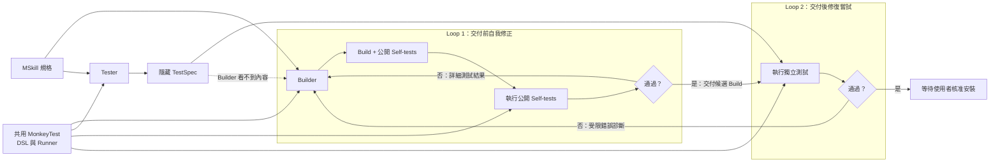

# MonkeySkill

MonkeySkill is an experimental Manifest V3 Chrome extension that generates, validates, and installs small browser abilities from human-readable MSkill specifications. It ships with no functional MSkills; specifications are selected from the separate [MonkeySkill Store](https://github.com/allenyllee/monkeyskill-store).

## Core properties

- No bundled functional MSkills or generated Store builds.
- A GitHub Pages Store that publishes only `skill.json` manifests and human-readable `SKILL.md` specifications.
- BYOK settings for an OpenAI-compatible Chat Completions endpoint, model, and API key.
- Separate Builder and Tester conversations.
- Builder-authored public self-tests and an independently generated hidden TestSpec.
- One shared, non-executable MonkeyTest DSL and trusted Runner for both test layers.
- Static capability, remote-content, size, schema, and Chrome `userScripts` parse checks.
- Durable offscreen generation jobs that survive MV3 service-worker suspension and Store refreshes.
- Explicit user approval after generation and validation, followed by another hidden-test run before installation.
- Per-site and global modes for every installed MSkill.

## Load in Chrome

1. Open `chrome://extensions`.
2. Enable **Developer mode**.
3. Choose **Load unpacked** and select this repository folder.
4. Open the Extension details and enable **Allow User Scripts**.
5. Open the options page and configure your LLM API.
6. Visit <https://allenyllee.github.io/monkeyskill-store/> to install an MSkill.

Developer mode is needed only because this repository is loaded unpacked. A Chrome Web Store build would not require it. **Allow User Scripts** remains required for runtime-generated builds.

## Store installation flow

1. The Store reads its generated `catalog.json`.
2. After the user chooses an MSkill, the Store sends only its `skill.json` and `SKILL.md` to the Extension.
3. The Extension validates the manifest and specification; the Store cannot submit a Build, JavaScript, HTML, or TestSpec.
4. Builder creates a candidate Build and public self-tests.
5. The shared Runner executes those self-tests and returns detailed structured failures for repair.
6. Independent Tester first treats the MSkill as untrusted input and returns `allow`, `reject`, or `unverifiable`. Only `allow` includes a hidden Independent TestSpec and permits Builder generation to begin.
7. The same Runner executes the hidden TestSpec, enforces capability-denial policy tests against the candidate, and returns only constrained diagnostics for repair.
8. After validation passes, the user reviews the summary, hash, validation results, and generated code.
9. The user approves installation or discards the candidate. Hidden behavior tests run again immediately before installation.

## Architecture



The first loop gives Builder detailed results from its public self-tests. The second keeps Tester's independent TestSpec hidden and returns only constrained diagnostics before another Builder attempt.

## Project boundaries

- `skills/mskill-creator/` defines how an agent authors implementation-independent MSkill specifications.
- `skills/mskill-installer/` is the isolated Builder policy.
- `skills/mskill-tester/` is the isolated Tester policy and shared MonkeyTest framework.
- `agent-skills.json` catalogs those three preinstalled agent policies.
- `src/lib/skill-store.js` validates, installs, removes, configures, and builds registrations for generated artifacts.
- `src/lib/llm.js` builds prompts, parses responses, and scans generated Builds.
- `src/store/bridge.js` accepts only constrained actions from approved Store pages.
- `src/validation/` owns the offscreen generation host, trusted Runner, and sandbox.

The functional MSkill catalog lives in [allenyllee/monkeyskill-store](https://github.com/allenyllee/monkeyskill-store). Its `skills/` directory is the source of truth, and GitHub Actions rebuilds the Pages catalog after every push to `main`.

Forked Stores are opt-in. Add a fork's GitHub Pages root URL under **Trusted MSkill Stores** in the Extension options and approve that origin. MonkeySkill then registers the constrained Store bridge only for that saved URL; unrelated pages on the same host are rejected by the background sender check.

## Local development

```powershell
npm test
npm run check
```

For Store development, clone the Store repository beside this one, run `npm run serve`, and open `http://127.0.0.1:4174/`.
Functional demos live with their MSkills in that Store repository and are linked from the corresponding catalog card.

## Local agent API

Run an OpenAI-compatible local endpoint:

```powershell
npm run serve:agent
```

Use the printed token with:

- Endpoint: `http://127.0.0.1:8787/v1/chat/completions`
- Model: `local-agent`
- API key: the printed token

The default fixture mode creates a generic schema-valid no-op response for the MSkill supplied in the request. It tests transport and integration without bundling a Store MSkill.

For interactive Codex testing, set `MONKEYSKILL_AGENT_MODE=subagent`. Builder and Tester use separate protected queues at `/agent/jobs/next?role=builder` and `/agent/jobs/next?role=tester`; repairs remain sticky to the original Builder worker. `MONKEYSKILL_AGENT_TIMEOUT_MS` controls the queue timeout.

Before asking a user to press **Generate**, restart a clean broker and run the mandatory transport preflight:

```powershell
npm run preflight:agent
```

The preflight sends disposable Builder and Tester requests through the Extension-facing API (normally port `8787`), claims them from the worker API on port `8788`, completes both jobs, and verifies that both HTTP requests receive valid completions. Only after it passes should two fresh `fork_turns="none"` subagents be started. Builder and Tester workers must poll port `8788`, not the Extension-facing port.

## Security boundary

The Store page is outside the Extension trust boundary. Its bridge is active only on approved Store URLs, and the background verifies the sender again. Store payloads may contain only a bounded manifest and human-readable specification. API keys stay in trusted Extension storage and are never returned to the Store page.

Generated code is statically scanned, parsed through a temporary Chrome `userScripts` registration, tested in sandboxed frames, displayed for review, and installed only after an explicit user action. These checks reduce risk but do not prove arbitrary JavaScript safe.
