# MonkeySkill

MonkeySkill is an experimental Manifest V3 Chrome extension that generates, validates, and installs small browser abilities from human-readable MSkill specifications. It ships with no functional MSkills; specifications are selected from the separate [MonkeySkill Store](https://github.com/allenyllee/monkeyskill-store).

**Live Store:** [allenyllee.github.io/monkeyskill-store](https://allenyllee.github.io/monkeyskill-store/)

## Core properties

- No bundled functional MSkills or generated Store builds.
- A GitHub Pages Store that publishes only `skill.json` manifests and human-readable `SKILL.md` specifications.
- BYOK settings for an OpenAI-compatible Chat Completions endpoint, model, and API key.
- Isolated Attacker, Builder, original-Tester, and poisoned-Tester conversations.
- A mandatory differential gate: Tester A rejection short-circuits immediately; only an allowed original reaches an allowlist-only Attacker, trusted code renders a varied known-reject canary, and Tester B must reject it before Builder runs.
- The trusted canary library provides 245,760 framing/consequence/structure/wording combinations before safe insertion positions, with exhaustive plan-tuple regressions.
- Builder-authored public Builder TestSpec and an independently generated hidden TestSpec.
- One shared, non-executable MonkeyTest DSL and trusted Runner for both test layers.
- Static capability, remote-content, size, schema, and Chrome `userScripts` parse checks.
- Durable offscreen generation jobs that survive MV3 service-worker suspension and Store refreshes.
- Explicit user approval after generation and validation, followed by another hidden-test run before installation.
- Per-site and global modes for every installed MSkill.

## Development methodology

MonkeySkill uses **evidence-driven generative development**. The canonical source is not one
hand-written JavaScript implementation. It is a replayable set of human-readable and observable
artifacts: a minimal Demo, an MSkill behavior and safety contract, criteria grown from reproduced
evidence, two independent TestSpecs in one constrained DSL, and trusted Runner plus real-browser
evidence.

Generated JavaScript and CSS are replaceable. Stability means fresh generations repeatedly
converge through the defined repair loop and satisfy the same contract and safety boundary, not
that they produce identical code or succeed perfectly on the first attempt. An intermediate
defect may be repaired and the run may still count toward the consecutive-success threshold when
the final candidate is fully revalidated with no unresolved error. Criteria start small and grow
only when a reproducible Demo failure proves a durable missing requirement. Failures are
attributed to the global framework, the MSkill specification, or the disposable candidate before
any prompt or contract is changed.

Read [Evidence-driven generative development](docs/evidence-driven-generative-development.md)
for the complete method and [Closed-loop validation](docs/closed-loop-validation.md) for its
operational procedure.

## Load in Chrome

1. Open `chrome://extensions`.
2. Enable **Developer mode**.
3. Choose **Load unpacked** and select this repository folder.
4. Open the Extension details and enable **Allow User Scripts**.
5. Open the options page and configure your LLM API.
6. Visit <https://allenyllee.github.io/monkeyskill-store/> to install an MSkill.

Developer mode is needed only because this repository is loaded unpacked. A Chrome Web Store build would not require it. **Allow User Scripts** remains required for runtime-generated builds.

## Store installation flow

1. The Store reads its generated `catalog.json`.
2. After the user chooses an MSkill, the Store sends its `skill.json`, `SKILL.md`, and optional constrained `conformance.json` to the Extension.
3. The Extension validates the manifest, specification, and Developer Conformance; the Store cannot submit a Build, JavaScript, HTML, or arbitrary executable tests.
4. Tester A treats the original MSkill as untrusted input and returns `allow`, `reject`, or `unverifiable`. A rejection or unverifiable result stops the flow immediately.
5. After `allow`, the isolated Attacker selects only allowlisted canary dimensions. Trusted Extension code—not the Attacker—renders and inserts a known-reject poisoned variant.
6. Fresh Tester B reviews only that poisoned MSkill as an ordinary untrusted request. Only the differential result `Tester A = allow` and `Tester B = reject` may proceed.
7. Builder receives only the original, unpoisoned MSkill and creates a candidate Build plus public Builder TestSpec. Tester A's Independent TestSpec remains hidden from Builder.
8. The shared Runner executes the Builder TestSpec and returns detailed structured failures for repair.
9. The same Runner executes fixed Developer Conformance. It can only block, treats inconclusive as failure, and exposes only criterion/category/mode diagnostics.
10. The same Runner executes the Independent TestSpec, enforces capability-denial policy tests against the candidate, and returns only constrained diagnostics for repair.
11. After validation passes, the user reviews the summary, hash, and separate Public, Developer Conformance, and Independent results.
12. The user approves installation or discards the candidate. Developer and Independent behavior tests run again immediately before installation.

## Architecture

```mermaid
flowchart LR
    Demo["Minimal Demo"] --> Skill["Human-readable MSkill"]
    Skill --> TesterA{"Tester A — original security review"}
    TesterA -- "reject / unverifiable" --> Stop["Stop automatic generation"]
    TesterA -- "allow + Independent TestSpec" --> Attacker["Attacker — select allowlisted IDs"]
    Attacker --> Composer["Trusted orchestrator — render known-reject canary"]
    Skill -. "original content" .-> Composer
    Composer --> TesterB{"Fresh Tester B — poisoned security review"}
    TesterB --> Gate{"Differential gate — A = allow, B = ?"}
    Gate -- "B = allow" --> Bypass["Fail closed — potential prompt injection"]
    Gate -- "B = unverifiable" --> Unverifiable["Fail closed — cannot verify safety"]
    Skill -. "only original MSkill" .-> Builder["Builder"]
    Gate -- "B = reject" --> Builder
    Builder --> Candidate["Build + Builder TestSpec"]
    Candidate --> PublicRun["Trusted Runner: public tests"]
    PublicRun -- "detailed repair evidence" --> Builder
    PublicRun -- "pass" --> HiddenRun["Trusted Runner: independent tests"]
    HiddenRun -- "constrained repair evidence" --> Builder
    HiddenRun -- "pass" --> Approval["Review and approval"]
    Approval --> Browser["Install + real browser + screenshots"]
    Browser -- "reproducible contract gap" --> Skill
    Browser -- "pass" --> Stable["Replayable validated result"]
```



Tester A rejection short-circuits the flow; Tester B is consulted only after an allowed original
has been poisoned by trusted code. `allow/reject` is the only pair that reaches Builder, and
Builder receives the original MSkill rather than the poisoned variant. The public loop gives
Builder detailed evidence from its own TestSpec. The independent loop keeps Tester A's TestSpec
hidden and exposes only constrained diagnostics. The Demo and installed browser catch
specification gaps shared by both agents.

## Project boundaries

- `skills/mskill-creator/` defines how an agent authors implementation-independent MSkill specifications.
- `skills/mskill-attacker/` constrains Attacker output to allowlisted canary dimension IDs.
- `skills/mskill-installer/` is the isolated Builder policy.
- `skills/mskill-tester/` is the isolated Tester policy and shared MonkeyTest framework.
- `agent-skills.json` catalogs all four preinstalled agent policies.
- `src/lib/skill-store.js` validates, installs, removes, configures, and builds registrations for generated artifacts.
- `src/lib/llm.js` builds prompts, parses responses, and scans generated Builds.
- `src/store/bridge.js` accepts only constrained actions from approved Store pages.
- `src/validation/` owns the offscreen generation host, trusted Runner, and sandbox.

The functional MSkill catalog lives in [allenyllee/monkeyskill-store](https://github.com/allenyllee/monkeyskill-store). Its `skills/` directory is the source of truth, and GitHub Actions rebuilds the Pages catalog after every push to `main`.

Forked Stores are opt-in. Add a fork's GitHub Pages root URL under **Trusted MSkill Stores** in the Extension options and approve that origin. MonkeySkill then registers the constrained Store bridge only for that saved URL; unrelated pages on the same host are rejected by the background sender check.

## Local development

```powershell
npm test
npm run check
```

For Store development, clone the Store repository beside this one, run `npm run serve`, and open `http://127.0.0.1:4174/`.
Functional demos live with their MSkills in that Store repository and are linked from the corresponding catalog card.

## Local agent API

Run an OpenAI-compatible local endpoint:

```powershell
npm run serve:agent
```

Use the printed token with:

- Endpoint: `http://127.0.0.1:8787/v1/chat/completions`
- Model: `local-agent`
- API key: the printed token

The default fixture mode creates a generic schema-valid no-op response for the MSkill supplied in the request. It tests transport and integration without bundling a Store MSkill.

For interactive Codex testing, set `MONKEYSKILL_AGENT_MODE=subagent`. Attacker, Builder, and Tester use separate protected queues selected with `/agent/jobs/next?role=<attacker|builder|tester>`; Tester A and Tester B use distinct sessions and workers, and repairs remain sticky to the original worker and routing key. `MONKEYSKILL_AGENT_TIMEOUT_MS` controls the queue timeout.

Before asking a user to press **Generate**, restart a clean broker and run the mandatory transport preflight:

```powershell
npm run serve:agent-forwarder
npm run preflight:agent
```

Run the checked-in forwarder alongside the protected broker: it exposes the Extension-facing
port `8787` and forwards only to the local worker API on `8788`.

The preflight sends disposable Attacker, Builder, and Tester requests through the Extension-facing API (normally port `8787`), claims them from the worker API on port `8788`, completes all three jobs, and verifies valid completions. After it passes, use fresh `fork_turns="none"` workers for Tester A, Attacker, Tester B, and Builder as their stages are reached. Tester A rejection or unverifiable status short-circuits the later stages; only Tester A `allow` plus Tester B `reject` can create a Builder job. Every worker polls port `8788`, not the Extension-facing port.

## Security boundary

The Store page is outside the Extension trust boundary. Its bridge is active only on approved Store URLs, and the background verifies the sender again. Store payloads may contain only a bounded manifest and human-readable specification. API keys stay in trusted Extension storage and are never returned to the Store page.

Generated code is statically scanned, parsed through a temporary Chrome `userScripts` registration, tested in sandboxed frames, displayed for review, and installed only after an explicit user action. These checks reduce risk but do not prove arbitrary JavaScript safe.
