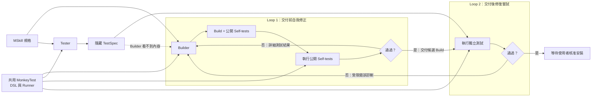

# MonkeySkill

MonkeySkill is an experimental Manifest V3 Chrome extension that installs small browser abilities per site. The first packaged skill independently reimplements the public behavior of **Absolute Enable Right Click & Copy**: restoring the native context menu, selection, copying, cutting, and dragging.

No source code or visual assets from the referenced extension are included.

## Current feature set

- Install the right-click skill for the current site or all HTTP(S) sites.
- Standard mode for normal copy/right-click blockers.
- Absolute mode for pages that continually re-register blockers.
- Per-site overrides over a global default.
- Optional host permissions requested only when the user enables a scope.
- Local-only settings; no analytics or network requests.
- A portable source containing only human-readable `SKILL.md` criteria and a capability manifest, stored separately from generated code.
- A single `.mskill.json` package descriptor that joins the separate specification and build at install time.
- A generic package installer used by bundled/preinstalled Skills and future imported `.mskill` packages.
- Uninstall/reinstall behavior that does not silently restore a removed preinstalled Skill on restart.
- BYOK settings for an OpenAI-compatible Chat Completions endpoint, model, and API key.
- A two-step LLM workflow: generate and validate a draft, then explicitly approve installation.
- A locally generated, schema-constrained TestSpec that is created independently from the build and run in isolated sandbox frames before both review and installation.
- Durable offscreen generation jobs, so multi-minute LLM requests survive MV3 service-worker suspension and Store refreshes preserve running, failed, and ready outcomes.
- Shared-framework local testing: the Builder produces public self-tests beside each candidate and receives detailed structured traces from the same Runner used for final validation. A separate Tester conversation still produces a hidden TestSpec that the Builder never receives.
- A non-executable test DSL covering DOM, events, forms, computed styles, geometry, relative layout, visibility, hit-testing, focus, scrolling, contrast, and ARIA ID relationships.
- High-level `paste-text` and `drag-select-text` DSL workflows replay complete browser interaction sequences; schema validation rejects weaker hand-written substitutes when paste or selection blockers are present.
- `click-control` and `click-page` workflows verify that restoring a protected page selection neither steals focus from a deliberately clicked control nor prevents an ordinary page click from dismissing the selection.
- Release-time selection blockers are replayed across a page-world callback checkpoint, preventing capture-phase microtask restoration from receiving a false pass that does not match real Chrome ordering.
- Runner primitive conformance tests verify focus, hit-testing, drag selection, and copy/cut default behavior before candidate tests run; unsupported or broken primitives are surfaced as inconclusive instead of being misreported as Builder failures.
- Diagnostic-driven generation retries use three attempts by default, extend to the full five after a diagnostic improvement, and stop immediately when the generated build hash is unchanged.
- Runtime-generated builds installed through `chrome.userScripts` while packaged builds continue to use `chrome.scripting`.

## Load in Chrome

1. Open `chrome://extensions`.
2. Enable **Developer mode**.
3. Choose **Load unpacked**.
4. Select this repository folder.
5. Open a regular website, click MonkeySkill, choose a mode, and apply it.

Developer mode is needed here only because this repository is loaded unpacked. A Chrome Web Store build would not require it.

For LLM-generated builds, open the extension's details page and enable **Allow User Scripts**. This is separate from loading the development extension itself.

## Generate from an MSkill

1. Open MonkeySkill's options page.
2. Enter an OpenAI-compatible Chat Completions endpoint, model name, and your own API key.
3. Save the settings and approve access only to that API origin.
4. Select **Generate and validate with my LLM**.
5. MonkeySkill first validates and runs the Builder's public self-tests in isolated frames. Self-test failures return detailed step traces to the Builder; after they pass, an independent hidden TestSpec runs in the same Runner and exposes only fixed criterion/category diagnostics.
6. Review the summary, validation results, hash, and complete generated JS/CSS.
7. Select **Approve and install** or discard the draft. The same build is tested again immediately before installation.

The API key is kept in `chrome.storage.local`, restricted to trusted extension contexts, and is never returned to the options UI after saving. This protects it from page scripts, but browser-local storage is not a hardware-backed secret store.

## Test page

Run:

```powershell
npm run serve:demo
```

Then open `http://127.0.0.1:4173/store.html` for the local MSkill Store, or `http://127.0.0.1:4173/blocked.html` for the 16-method behavior matrix.

The Store reads the Extension's packaged catalog, asks before sending an MSkill to the configured LLM, waits for static and independently generated behavior validation, shows the model/hash/validation summary, asks for final approval, and only then installs the generated build. Its page bridge is injected only on the two local Store URLs declared in `manifest.json`; background handlers independently verify the sender URL.

## Local agent API

Run a local OpenAI-compatible endpoint that exercises the complete Extension request, generation, validation, review, and approval path:

```powershell
npm run serve:agent
```

The server prints a random local token. In MonkeySkill's LLM settings use:

- Endpoint: `http://127.0.0.1:8787/v1/chat/completions`
- Model: `local-agent`
- API key: the printed local token

The default `fixture` agent runs offline and deterministically turns the bundled Restore right click MSkill into a response with the same shape as Chat Completions. This verifies the whole integration without spending API credits. Each call creates an inspectable conversation; use the printed `/sessions` URL with the same bearer token.

To hand the conversation to a real upstream OpenAI-compatible agent instead, keep the Extension pointed at localhost and start the bridge in proxy mode:

```powershell
$env:MONKEYSKILL_AGENT_MODE = "proxy"
$env:MONKEYSKILL_UPSTREAM_API_KEY = "your-upstream-key"
$env:MONKEYSKILL_UPSTREAM_MODEL = "your-model"
npm run serve:agent
```

Optional variables are `MONKEYSKILL_UPSTREAM_ENDPOINT`, `MONKEYSKILL_LOCAL_TOKEN`, `MONKEYSKILL_AGENT_PORT`, and the subagent queue timeout `MONKEYSKILL_AGENT_TIMEOUT_MS`. The upstream key stays in the local server process and is not stored by the Extension.

For an interactive Codex-only experiment, `MONKEYSKILL_AGENT_MODE=subagent` exposes protected role queues at `/agent/jobs/next?role=builder&worker=<stable-worker-id>` and `/agent/jobs/next?role=tester&worker=<stable-worker-id>`. Builder and Tester workers cannot consume each other's jobs. The Extension gives every generation run stable local Builder and Tester session IDs, so Builder repairs remain leased to the Builder worker that produced the initial candidate. A Builder worker should remain available for up to five total attempts. Complete a leased job by posting `{ "worker": "<same-worker-id>", "content": "..." }` to `/agent/jobs/{id}/complete`; a different worker receives HTTP 409. This mode is intentionally not presented as a standalone background service.

## Development

```powershell
npm test
npm run check
```

## Skill package lifecycle

Development follows the same lifecycle as a future user installation:

```text
skills/restore-right-click/            Human-readable specification only
        +
Builder public self-tests + independent Tester hidden TestSpec, both generated locally
        +
generated/restore-right-click/1.2.0/   Optional bundled build descriptor
        ↓
packages/restore-right-click.mskill.json
        ↓
installSkillPackage()
        ↓
chrome.storage.local: installedSkills
        ↓
chrome.scripting registrations
```

`preinstalled-skills.json` does not bypass installation. It only selects `.mskill.json` package descriptors that should be passed through the normal installer the first time the extension is installed. If a user removes one, its seeded marker prevents it from being silently restored on the next startup. Reinstalling it explicitly uses the same installer again.

## Architecture

### Builder and Tester validation loops



The first loop gives the Builder detailed results from its public self-tests. The second loop keeps the independent Tester's TestSpec hidden and returns only constrained diagnostics before another Builder attempt.

- `skills/restore-right-click/` contains only the first Monkey Skill specification and manifest; it contains no executable or declarative tests.
- `skills/mskill-creator/` defines how an agent authors implementation-independent MSkill specifications.
- `skills/mskill-installer/` is the isolated Builder policy used when the user's LLM compiles a specification and authors public self-tests with the shared framework.
- `skills/mskill-tester/` is the separate Tester policy that translates visible criteria into a non-executable TestSpec DSL.
- `generated/restore-right-click/1.2.0/` contains the current optional bundled build descriptor; generated tests are local installation artifacts rather than shared MSkill content.
- `packages/*.mskill.json` joins one specification and one generated build into a single installable package descriptor.
- `preinstalled-skills.json` is the bundled catalog and preinstall policy.
- `agent-skills.json` catalogs the preinstalled Creator, Installer, and Tester policies used by LLM workflows.
- `src/lib/skill-store.js` validates, installs, removes, configures, and builds registrations for Skill packages.
- `src/lib/llm.js` normalizes BYOK settings, builds generation prompts, parses output, and runs capability checks.
- `src/background.js` loads packages through the common installer and synchronizes installed builds with Chrome.
- `src/popup/` installs/configures the skill for the active site.
- `src/options/` manages global settings and site overrides.

The preinstalled build uses packaged scripts through `chrome.scripting`, so it works without Chrome's **Allow User Scripts** toggle. A user-approved LLM build uses `chrome.userScripts` and requires that explicit opt-in.

## Security boundary

The Restore right click skill has no network, cookie, history, or download capability. Generated code is rejected when basic static checks detect forbidden APIs or remote content, Chrome parses it through a temporary `userScripts` registration, and Builder-authored public self-tests plus an independently generated hidden TestSpec run in sandboxed frames before review. The hidden TestSpec runs again before installation. Neither shared MSkills nor either test producer can provide HTML, executable test code, remote URLs, or free-form failure messages. These checks reduce risk but do not prove arbitrary JavaScript safe, so installation remains a separate explicit user action. Absolute mode intentionally changes page-level event behavior and can break legitimate custom context menus; disable it for affected sites.
