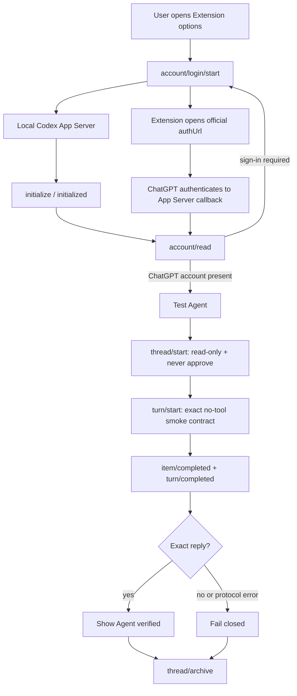

# ChatGPT Agent integration POC

MonkeySkill 0.3.8 adds an experimental Extension-to-Agent path through a tokenized local Browser
Bridge and Codex App
Server. It proves that a user who already has Codex can authorize MonkeySkill with the user's
ChatGPT account instead of placing an API key inside the Extension. It does not yet migrate the
production MSkill generation and validation roles away from BYOK.

## Boundary

- Codex App Server rejects every browser WebSocket carrying an `Origin` header. The Extension does
  not attempt a direct connection or ask users to weaken that protection.
- The bridge connects to App Server without a browser Origin and accepts only a loopback `ws://`
  URL containing its freshly generated 256-bit token. Remote hosts, missing tokens, and URL
  credentials fail closed.
- The first user-initiated Agent action requests optional permission only for the selected
  localhost origin before opening its WebSocket.
- Codex App Server owns ChatGPT authentication and cached credentials. The Extension receives an
  authorization URL and redacted account fields, not cookies or tokens.
- Login uses the hosted ChatGPT success page and the local callback owned by App Server.
- The smoke test uses `approvalPolicy: never`, a read-only sandbox, a prompt that explicitly
  forbids tools, and an exact expected response.
- The smoke-test thread is archived after success or failure. It is never reused as a Builder,
  Tester, or Attacker.
- Existing BYOK generation remains unchanged until separate Agent roles, repair routing,
  interruption recovery, and pre-install replay are independently demonstrated.

Official protocol references: [Codex App Server](https://learn.chatgpt.com/docs/app-server) and
[Authentication](https://learn.chatgpt.com/docs/auth).

## Flow

## Operation

1. Start `codex app-server --listen ws://127.0.0.1:4500` outside the browser. On Windows without a
   global CLI command, run
   `npx.cmd --yes @openai/codex@0.149.0 app-server --listen ws://127.0.0.1:4500`.
2. In this repository, run `npm run serve:codex-bridge` and keep the terminal open.
3. Reload MonkeySkill 0.3.8 and open its options page.
4. Paste the complete printed Browser Bridge URL, then select **Check connection** and approve the
   matching localhost origin permission.
5. If sign-in is required, select **Sign in with ChatGPT**, complete the official browser flow,
   and check the connection again.
6. Select **Test Agent**. A pass requires the exact final answer
   `MONKEYSKILL_AGENT_OK`; connection alone is not sufficient.

## Evidence

The module tests replay the full wire sequence with a deterministic fake App Server, enforce the
tokenized loopback bridge URL, and prove that an incoming `chrome-extension://` Origin is removed
before the upstream handshake. They also verify account-field redaction. A real Codex CLI 0.149.0 run additionally
completed the handshake, read a ChatGPT subscription account, ran the isolated turn, received the
exact final answer, and archived the generated thread.

The real run also exposed two version-sensitive wire details now covered by regression tests:
legacy `thread/start.sandbox` uses `read-only`, while current `turn/start.sandboxPolicy` accepts
`{ "type": "readOnly" }` without the older `access` member. This is why the POC pins its tested
message shapes instead of assuming documentation examples and installed CLI releases are always
identical.

## Next integration gate

Before this path can replace BYOK generation, the orchestrator must prove four isolated Agent
threads (Tester A, Attacker, Tester B, and Builder), sticky repair routing, constrained evidence
projection, cancellation and service-worker recovery, and the existing pre-install independent
replay. Authentication success or one smoke-test turn does not satisfy that gate.
