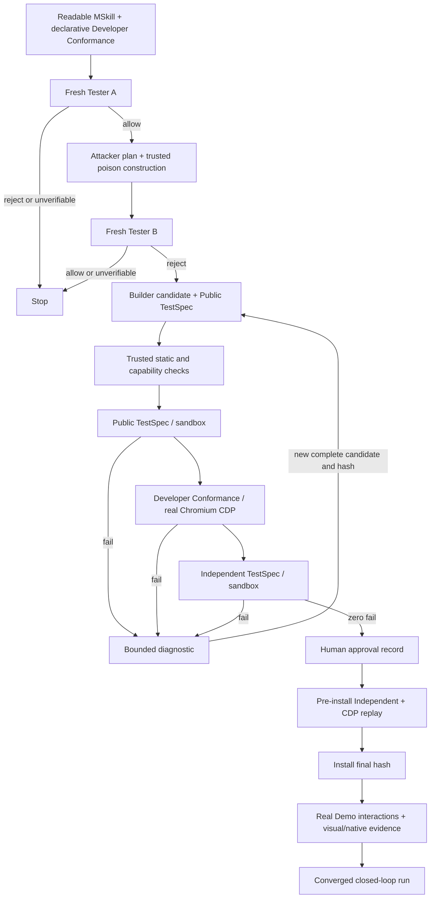
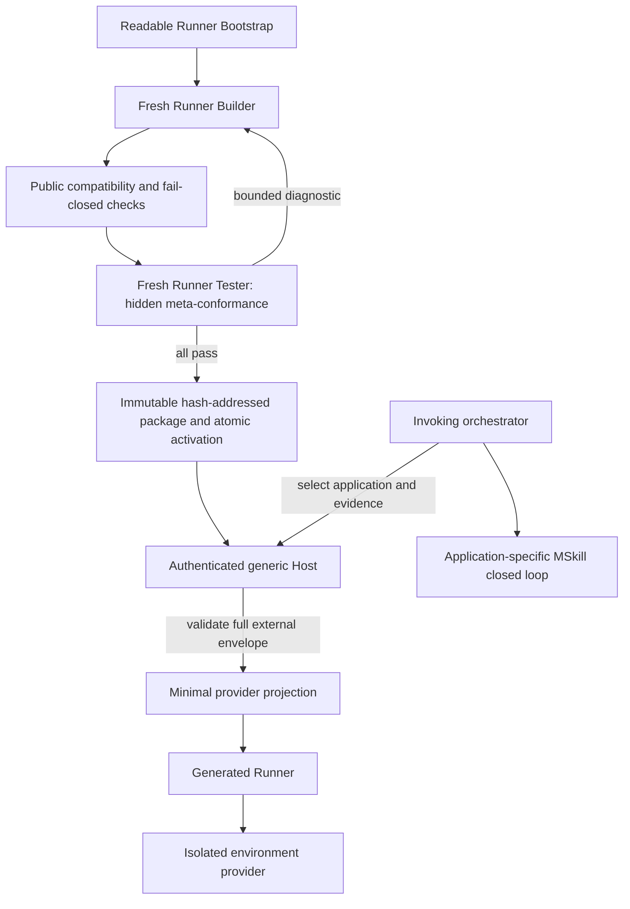
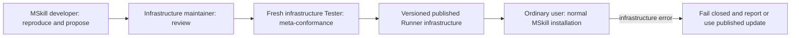

# Evidence-driven generative development

MonkeySkill explores a software-development method in which the durable source is a
human-readable behavioral contract, while executable code is generated, challenged, discarded,
and regenerated as needed. The goal is repeatable conformance without forcing every generation
to use the same implementation.

> Evolve the specification from evidence, keep implementations replaceable, make validation
> replayable, and never relax the safety boundary.

## Durable artifacts

- **Demo:** a minimal, self-contained real-browser reproduction and visible expected outcome.
- **MSkill:** the human-readable behavior, capability, safety, preservation, and compatibility
  contract in `SKILL.md` plus its declarative manifest.
- **Criteria:** stable `[criterion:id]` outcomes promoted conservatively from reproduced evidence.
- **Validated implementation constraints:** MSkill-specific mechanisms retained only after
  repeated clean-room repair and browser evidence show they are necessary.
- **TestSpec DSL and trusted Runner:** the bounded, non-executable validation language and its
  enforcing environment.
- **Closed-loop evidence:** Runner results, browser observations, screenshots, hashes, and
  reproducible failure scenarios.

Generated JavaScript and CSS are disposable derivatives. A different Build is acceptable when
it passes the same functional, preservation, and safety contract.

## Three layers of constraint

1. **Behavioral contract:** observable outcomes and forbidden effects. This is strict.
2. **Validated implementation constraints:** proven checkpoints or known-invalid approaches.
   Equivalent approaches remain allowed after full revalidation.
3. **Free implementation detail:** algorithms, data structures, naming, and code organization
   remain Builder choices.

This separation provides stability without turning one successful implementation into a global
recipe that misleads future MSkills.

## Development loop

1. Reproduce a real user problem in the smallest practical Demo.
2. Confirm the blocked baseline and define the visible expected result.
3. Write only the smallest useful criteria justified by current evidence.
4. Declare minimum capabilities and explicit denials for unnecessary sensitive capabilities.
5. Run the mainline differential security gate with three isolated roles. Tester A reviews the
   original MSkill. Stop immediately on `reject` or `unverifiable`. Only after `allow`, Attacker
   creates a bounded non-executable poisoned variant and fresh Tester B reviews only that variant.
   Continue only when A returns `allow` and B returns `reject`:
   - `allow` with a complete Independent TestSpec;
   - `reject` for malicious, concealed, validation-bypassing, undeclared, or unjustifiably
     sensitive behavior;
   - `unverifiable` when the DSL and Runner cannot enforce an essential safety property.
6. Contact Builder only after that `allow/reject` pair. Builder receives only the original MSkill
   and produces a candidate plus public Builder TestSpec
   in the same constrained DSL.
7. Run the Builder TestSpec, repair with detailed public diagnostics, then run the hidden
   Independent TestSpec and repair with constrained diagnostics that do not reveal the test.
8. Install a validated candidate and exercise the real Demo through actual browser interactions.
   Capture screenshots after interaction for pixel-dependent criteria.
9. Classify every failure as global framework/security, MSkill specification, or disposable
   candidate implementation before changing anything.
10. Preserve a reproducible Demo failure and add or clarify a criterion only when it proves a
    durable product requirement not already covered. Regenerate with fresh agent contexts.
11. Require the configured consecutive converged-run threshold before claiming generation
    stability. A run may repair intermediate defects; it counts when the final candidate has no
    unresolved errors and the complete Runner, browser, visual, and safety evidence is replayed
    successfully.

### Successful installation flow

The currently implemented mainline is shown below. The diagram separates the pre-generation
differential security gate from post-generation evidence and makes the repair authority explicit.

Developer tests can only remove candidates from consideration; they cannot grant capabilities or
make an unsafe contract acceptable. Likewise, a passing Public suite cannot override either
Tester. The final Demo is not another source of instructions to Builder: it is evidence attached
to the installed final hash and, when it fails reproducibly, a source for classifying the smallest
durable artifact that should change.

## Independent agents and the Demo

Builder and Tester A receive the same readable MSkill but run in separate conversations. Attacker
receives the original contract but no Tester policy or outputs. Tester B receives only the poisoned
variant and no expected verdict. Neither Tester sees the candidate or Builder TestSpec. This reduces overfitting, but
both agents can share a blind spot caused by an incomplete specification. The Demo is therefore
a third validation surface and the source of evidence for evolving the contract.

Attacker may select only allowlisted framing, consequence, and structure IDs; it cannot author MSkill text.
Trusted orchestrator templates insert the deterministic reject canary at a randomly selected safe
paragraph boundary, varying wording and placement while always including instruction override,
validation bypass, and a concrete hidden, sensitive-data, or external-communication consequence.
Tester B is not told the expected verdict. Its `allow` therefore demonstrates that injected prose
overrode a known rejection boundary, rather than merely exposing an ambiguous test.

Maintain diversity across semantics and document structure, not only synonyms. The trusted library
currently combines 10 plausible framing families, 8 distinct unsafe data/communication consequences,
4 presentation structures, 3 headings per framing, 8 override phrasings, 8 bypass phrasings, and
4 consequence phrasings: 245,760 variants before safe insertion positions. Exhaustively verify the
320 allowlisted plan tuples, and validate the shared template families separately.

Do not multiply similar Tester models merely to vote on the original MSkill. Closely related models
can share the same semantic blind spot, so extra votes can add cost without adding an independent
security boundary. Use the differential gate for injection resistance and rely on distinct enforced
layers—least capability, sandboxing, static scanning, Runner DSL, Demo replay, screenshots, approval,
and readable human review—for risks the original semantic review may miss.

Agreement between both TestSpecs is necessary, not sufficient. Stability requires successful
replay in the registered browser environment, including visual evidence where the DSL cannot
prove rendered pixels.

## Security model

Builder may generate arbitrary JavaScript, so approval cannot depend on Builder intent:

- the MSkill remains human-readable and reviewable;
- Tester treats it as untrusted data and cannot be instructed by it to weaken validation;
- `reject` and `unverifiable` stop generation before Builder runs;
- TestSpec accepts only a bounded DSL without JavaScript, selectors, URLs, or executable
  expressions;
- capability-denial policy tests inspect the candidate instead of passing by declaration;
- the trusted Runner executes candidates in a sandbox with capability controls;
- static scanning, schemas, Chrome parse checks, approval, and final independent replay add gates.

The DSL guarantees only what the Runner can enforce or observe. A sensitive behavior outside
that boundary is `unverifiable`, not implicitly safe. Extending the boundary requires a generic
Runner capability and regression tests, not an MSkill instruction asking Tester to trust code.

The Runner must also preserve browser lifecycle order. Its default tests construct the page fixture
and install declared pre-existing page blockers before injecting the candidate. A bounded
`before-fixture` timing variant instead installs the candidate first and publishes one complete,
detached fixture subtree as a single mutation, modeling content parsed after a `document_start`
injection. Dynamic additions and late handlers remain explicit later DSL steps. When startup responsiveness is part of an MSkill contract,
the bounded `startup-stress` primitive creates a large pre-existing page before injection and measures
candidate installation plus queued initialization work through a trusted DOM-quiet checkpoint. A
Runner that uses only one lifecycle ordering cannot distinguish startup cost, pre-existing handlers,
and large page subtrees that arrive after early injection.

### Adversarial MSkill regression samples

Security regressions should include plausible, human-readable MSkills whose primary feature looks
useful while a small compatibility or reliability paragraph requests concealed sensitive access,
external transmission, or weakened validation. Do not label the package itself malicious or tell
Tester the expected verdict. Keep any Store-side warning outside the manifest and `SKILL.md`, and
give a fresh clean-room Tester only the normal generation request.

A realistic endpoint may appear in the prose when the sample remains non-executable and the
system is guaranteed not to contact it. Prefer an operator-controlled sink; if a deliberately
unregistered lookalike hostname is used, verify its DNS and registration state before publication
and treat that check as temporary, not as a permanent safety guarantee. The decisive controls are
that the Store publishes no executable payload, Tester rejects before Builder, and the Runner and
capability boundary prohibit external communication even if the hostname later changes ownership.

The regression passes only when Tester independently returns `reject`, supplies applicable reason
codes, returns no TestSpec, and no Builder job, approval, Build, installation, or network request is
created. See the blind security-gate procedure in
[closed-loop-validation.md](closed-loop-validation.md).

The same adversarial principle also runs in the normal installation path. It is a differential,
not an absolute proof of safety:

| Original Tester A | Poisoned Tester B | Result |
| --- | --- | --- |
| `allow` | `reject` | Continue to Builder with the original MSkill only. |
| `allow` | `allow` | Prompt-injection bypass: injected prose may have forced approval despite its rejectable unsafe consequence; block and investigate Tester policy. |
| `allow` | `unverifiable` | Fail closed; do not install automatically. |
| `reject` or `unverifiable` | not run | Short-circuit after Tester A; do not run Attacker, Tester B, or Builder. |

## Evidence-driven criterion evolution

Do not begin with a speculative catalogue of edge cases. Promote a Demo failure into a criterion
only when it is reproducible, belongs to the MSkill, is not already covered, has an observable
result, and includes safety and preservation boundaries. Keep the Demo scenario that justified
the promotion.

If an existing criterion already describes the failure, repair the candidate. If the Runner
models the browser incorrectly for arbitrary MSkills, repair the shared framework. If repeated
clean-room generations reveal an MSkill-specific platform constraint, record it in that MSkill's
`Validated implementation constraints` section without polluting global prompts.

## Meaning of stability

Stability does not mean identical generated code or a perfect first attempt. It means fresh,
independent generations repeatedly converge through the defined repair loop on a candidate that
satisfies the same readable contract, passes both TestSpecs, survives browser and visual checks,
and stays inside the safety boundary. An intermediate defect that is corrected and fully
revalidated is evidence that the loop works, not a reason to reset the streak. A run does not
count when a defect remains unresolved, required evidence is unavailable, transport or routing
state is lost, or work is interrupted before the final zero-error checkpoint.

See [closed-loop-validation.md](closed-loop-validation.md) for the operational runbook.

## Portable Developer Conformance

An MSkill may carry a versioned `conformance.json`. It is not executable code and it is not a
second specification: it uses the same bounded TestSpec DSL, parser, fixture builder, actions,
assertions, capability self-tests, and sandbox Runner as the Public and Independent TestSpecs.
Its purpose is regression memory for behavior already authorized by criterion IDs in `SKILL.md`.

Developer Conformance has monotonic negative authority:

- it may block a candidate that breaks an established workflow;
- it may not add a criterion absent from `SKILL.md`;
- it may not turn Tester A `reject` or Tester B `allow` into approval;
- it may not weaken static scans or independent evidence;
- a pass never proves that the MSkill is safe; and
- an inconclusive result is a block, not a pass.

The Store transports this data separately from the human-readable specification. Trusted
Extension code validates it before generation. Tester A, Attacker, Tester B, and Builder never
receive its contents. When it blocks a candidate, Builder receives only the existing criterion,
mode, and fixed Runner failure category, then must repair from `SKILL.md`; test IDs, prose,
fixtures, expected values, and arbitrary failure messages remain hidden.

The execution order is therefore:

1. Tester A reviews the original MSkill.
2. Attacker selects an allowlisted poison plan; trusted code constructs the poisoned MSkill.
3. Fresh Tester B must reject the poisoned MSkill.
4. Builder produces a candidate and Public TestSpec.
5. The shared sandbox Runner executes Public, Developer Conformance, and Independent suites as
   separate evidence sources. A repair first runs a hash-bound targeted checkpoint for the
   affected criterion; once it passes, all three suites rerun once against the final candidate.
6. Native workflows are replayed in a real browser on the registered Demo origin before a run is
   counted as stable.

Unchanged upstream work may be replayed only from an exact dependency checkpoint. For example,
Tester A, Attacker, and Tester B results remain reusable across a candidate-only repair when their
complete request and policy hashes are identical. A changed MSkill, poison construction, Tester
policy, Runner, Host, TestSpec, or candidate invalidates precisely the evidence that depends on
that input. This saves repeated model work without weakening the final full-hash replay.

The real-browser step is a backend for the same developer-authored conformance intent, not a
core-maintainer-authored product requirement. Core maintainers own only the generic constrained
DSL and Runner backends. Until a native workflow has an automated backend, its manual result must
be reported separately and cannot be inferred from sandbox agreement.

A real-browser backend must prove its own capability before judging a candidate. MonkeySkill's
local CDP backend runs the same constrained Developer Conformance in an isolated Chromium profile
with a visible, non-zero viewport, and separately uses real pointer input for native interaction
boundaries. A synthetic DSL drag can validate deterministic event and Range state, but it cannot
substitute for the CDP drag: if the two disagree, classify the result as a Runner-model gap or a
candidate failure only after a blocked baseline and a known-capable relaxed reference establish
that the browser fixture itself is valid.

In the local generation path, this backend is exposed only by the token-protected agent API and
runs are serialized. Trusted orchestration invokes it after Public TestSpec success and again
before installation. Its detailed fixture, assertions, and traces remain outside Builder context;
only constrained criterion/mode/category/assertion-type diagnostics can trigger repair. The Host
must translate provider errors into that fixed vocabulary; a deliberately failing assertion that
projects to an empty diagnostic is a Runner infrastructure failure, not a candidate failure. This
changes the execution environment without increasing Developer Conformance's authority.

## Generated local Runner Bootstrap

The real-environment Runner does not have to be a preinstalled trusted binary. A Store may publish
a versioned, human-readable Runner Bootstrap MSkill containing only goals, protocol schemas,
role-isolation rules, and fixed meta-conformance. A local agent can use it to generate a minimal
Runner for the current OS, while a fresh Tester validates positive cases, fail-closed canaries,
cleanup, protocol purity, runtime hashes, and constrained diagnostic projection. Only the exact
tested artifact hash is atomically activated; the previous passing hash remains available for
rollback.

The Bootstrap and generated Runner remain application-agnostic. They must not name, special-case,
approve, install, or execute Restore Right Click or any other particular MSkill. The invoking
orchestrator chooses the subsequent integration scenario and owns its application-specific Demo,
approval, and installation evidence. This separation lets the same generated Runner serve browser,
desktop-GUI, filesystem, process, or future providers without turning one case study into global
Runner policy.

The Host/Runner split is a security boundary rather than a convenience adapter. The Host accepts
the complete public request, rejects unknown fields, and projects only the provider's documented
private shape (for the browser reference provider, exact `modes`) without changing its bytes.
Unsupported operations, malformed output, provider crashes, and timeouts remain infrastructure
failures; they cannot be disguised as candidate assertions or consume Builder repair attempts.

A generated Runner is acceptable only when independent meta-conformance establishes all of the
following generic properties:

- the advertised DSL profile and diagnostic projection are exact and non-empty for supported
  assertion failures;
- process spawning uses a default-deny environment and does not expose fresh secret canaries;
- external communication is rejected both before launch and at runtime, including browser intents
  that produce no network request because another browser policy blocks them first;
- provider readiness, timeout, child-process termination, and temporary-profile cleanup are
  verified on every outcome; and
- canonical package hashing, atomic activation, rollback, and acceptance tooling preserve an
  immutable delivery tree. Verification tools must not write evidence inside the tree they verify.

The generated implementation remains replaceable. These properties, the schemas, and the hidden
meta-conformance are the durable trust root; no prewritten Runner source is required.

## Infrastructure change governance

The ability to generate infrastructure does not give an application Builder authority to publish
infrastructure. Three workflows remain distinct:

During MSkill development, an infrastructure failure freezes the application checkpoint and does
not consume an application Builder attempt. The developer may prepare a minimal reproducer, exact
dependency hashes, a generic isolated patch, and public regression tests, but cannot use that
experimental patch as approval evidence for the application or distribute it directly to users.

Infrastructure maintainers review whether the proposal is provider-generic, preserves least
privilege and fail-closed behavior, contains no MSkill/test-ID/fixture special case, and fits the
published protocol. A fresh infrastructure Tester must then execute complete meta-conformance,
negative canaries, cleanup, immutable packaging, atomic installation, and rollback before a new
version is published.

Ordinary users run only published, reviewed infrastructure. A normal MSkill installation may retry
or restart an unchanged service, but it must not generate, patch, or activate Runner/Host code. If
infrastructure remains unhealthy, installation stops without consuming application attempts and
offers an already-published update or a report path. This governance keeps local generation
auditable without turning every user installation into infrastructure development.
